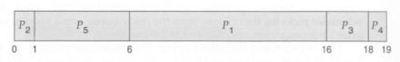

# Priority Scheduling
A presentation by Jakob H., Laurin and Isabel

---

## Introduction
- every process has a priority
- task with the highest priority is ran first
- equal priority => first come first serve (FCFS)
- priority ranges not generally defined

---

## An example
Assumption: lower number = higher priority
|Process|Burst Time|Priority
|----|----|----|
|P1|10|3|
|P2|1|1|
|P3|2|4|
|P4|1|5|
|P5|5|2|

---

## Resulting CPU time

|Process|Burst Time|Priority
|----|----|----|
|P1|10|3|
|P4|1|5|
|P5|5|2|

---

## Assigning Priorities
- External
	- manually setting a priority (nice)
	- how much did the customer pay?
	- how important is the task to the user?
- Internal
	- based on measurable quantities
		- number of open files
		- memory requirement
		- time limit

---

## Preemptive vs Nonpreemptive
### Preemptive
"preempt" CPU if priority of new process > running process
### Nonpreemptive
Task will continue to run, new one is at head of queue

---

## Starvation
- low-priority process never get to run
- higher priority processes "cut the line"
- two possible behaviours:
	1. process will run at an unconventional time
	2. process keeps waiting indefinitely

---

## Starvation - a solution: aging
- increase priority of processes waiting for a long time
- for example:
	- priority from 127 (low) to 0 (high)
	- increase priority by 1 every 15 minutes
	- => process is ran after 32 hours at max
- avoids infinitely waiting processes (starvation)

---

## When?
### Advantages
- ease
- important tasks get more resources
- precise scheduling based on priority
### Disadvantages
- crashes lead to processes being lost
- starvation (can be mitigated)

---

## Thank you for your attention!
